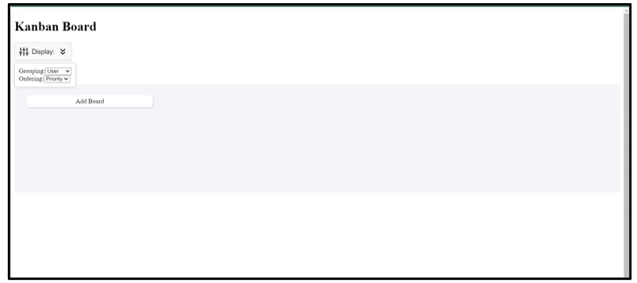

# Kanban Board Project Documentation

## Introduction

Welcome to the Kanban Board project documentation! This project is designed to help individuals and teams manage their tasks efficiently using the Kanban methodology. Kanban is a visual project management system that helps streamline workflow and improve overall productivity.

## Key Features

- **Task Management:** Create, edit, and organize tasks seamlessly.
- **Visual Boards:** Intuitive and visually appealing boards for task tracking.
- **User Collaboration:** Foster collaboration by assigning tasks and adding comments.
- **Customization:** Tailor boards, columns, and cards to fit your project's unique needs.

## Getting Started

### Installation

To get started with the Kanban Board project, follow these installation steps:

npm install

## Configuration
Make sure to configure your project settings according to your preferences.
### Running the Project
Start the project locally using the following command:

npm start

#### Kind Note:
When clicking the display button, for the first time please select either priority or the status, later you can view the user, there is some glitch in the code, due to the time constraint, I was not able to correct it.
## Features
### Visual Task Management
Our Kanban board provides a visual representation of your tasks, making it easy to track progress and prioritize work.
### User-Friendly Interface
The user-friendly interface ensures a seamless experience, even for those new to Kanban methodology.
### Task Customization
Tailor tasks with due dates, priorities, and tags to keep your workflow organized.
### Usage
Explore the various features and functionalities to effectively manage your projects with Kanban boards.

## Components and Modules
### Kanban Board Component
The core component responsible for rendering and managing Kanban boards.
Click on the display option, you are provide with 2 options Grouping and Ordering, Select your choices for the display
 
  
### Task Board Module
A modular component for displaying and interacting with individual task cards.
The task cards will be displayed based on the Grouping options that you selected
 
The above  is for the Priority Grouping
 
 
The above  is for the User grouping
  
The above  is for the Status grouping
### Add New Board
There is an option provided to add the new board to the existing board, if a new task needs to be added.
  

## Task Card Module:
### Delete Card:
Each card is provided with an option to delete the card on pressing … icon
  
### Add New Card: 
Each card is provided with an option to add the card on pressing + icon
 
 
### Additional Information about Card: 
Each card is provided with an option to view additional information about the card on pressing … icon provided below the card
 
 
### Updating the Card:
Each card is provided with an option to update the card on pressing Feature request button provided below the card 
 
 
### Drag and Drop:
You can drag the card from one board and place it in another board which enables one of the important feature of kanban application
  

Feel free to adapt and expand upon this introduction to better suit your specific Kanban project.
